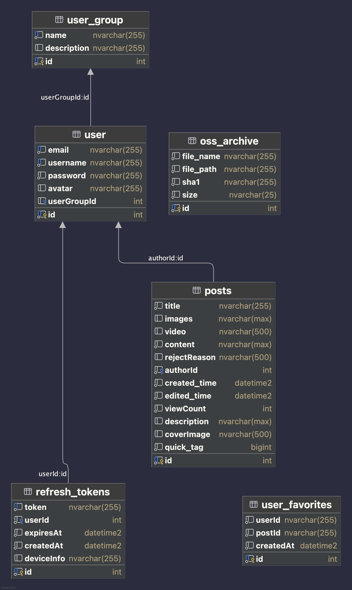

# 2025携程前端训练营大作业旅游日记后端

## 项目简介
本项目是个人完成的2025携程前端训练营大作业旅游日记平台的后端  。
该项目是一个基于 NestJS 和 TypeORM 的后端服务，支持用户创建、管理和搜索旅行日记。项目提供了丰富的 API 接口，包括用户管理、文章管理、审核功能等。

## 目录结构
```
src/
├── auth/                # 用户认证模块
├── common/              # 公共装饰器、枚举和工具库
├── config/              # 配置文件（如数据库和 JWT 配置）
├── constants/           # 常量定义
├── entity/              # 数据库实体定义
├── features/            # 核心功能模块
│   ├── backblaze/       # 提供基于Backblaze B2的文件存储服务
│   ├── oss-archive/     # 记录已上传的文件，去重
│   ├── posts/           # 游记的创建、修改、搜索、审核等核心逻辑
│   ├── user/            # 用户注册、登录、收藏等逻辑
```

## 安装与运行

### 环境要求
- Node.js >= 16.x
- pnpm 包管理工具
- 数据库（我使用的是SQL Server）

### 安装依赖
```bash
pnpm install
```

### 配置环境变量
在项目根目录下创建 `.env` 文件，并根据 `src/config` 中的配置文件设置必要的环境变量，包括数据库连接信息和 JWT 密钥。如果需要使用文件上传的功能，则还需要添加BackBlaze的密钥。  
你的.env文件应该类似这样
```env
DB_TYPE=mssql
DB_HOST=yourhost
DB_PORT=yourport
DB_USERNAME=yourusername
DB_PASSWORD=yourpassword
DB_DATABASE=yourdatabasse
DB_SYNCHRONIZE=true

JWT_SECRET=
JWT_TOKEN_AUDIENCE=
JWT_TOKEN_ISSUER=
JWT_ACCESS_TOKEN_TTL=
JWT_REFRESH_TOKEN_TTL=

B2_APPLICATION_KEY_ID=
B2_APPLICATION_KEY=
B2_BUCKET_NAME=
B2_ACCOUNT_ID=

```

### 启动项目
开发模式：
```bash
pnpm start:dev
```

生产模式：
```bash
pnpm build
pnpm start:prod
```

## 功能说明
- **用户管理**：支持用户注册、登录，部分接口实现权限控制。
- **文章管理**：支持文章的创建、编辑、删除、审核和搜索。
- **文件存储**：集成 Backblaze B2，用于存储用户上传的图片和视频,通过SHA1进行去重。
- **权限控制**：基于用户组（如管理员、审核员）实现权限管理。
  

## 权限说明
- 普通用户：注册、登录、查看公开游记、创建和编辑自己的游记
- 审核员：访问待审核文章列表、执行审核操作
- 管理员：用户管理、强制删除文章等高权限操作

所有需要登录的接口使用 JWT 进行鉴权，通过 `Authorization: Bearer <token>` 携带。

## UML图


## API 文档
项目的 API 文档可以通过以下方式访问：
- 使用 Swagger：启动项目后访问 `http://localhost:<port>/docs` 查看 Swagger 文档。

## 部署
1. 确保生产环境已安装 Node.js 和数据库。
2. 构建项目：
   ```bash
   pnpm build
   ```
3. 启动服务：
   ```bash
   pnpm start:prod
   ```

